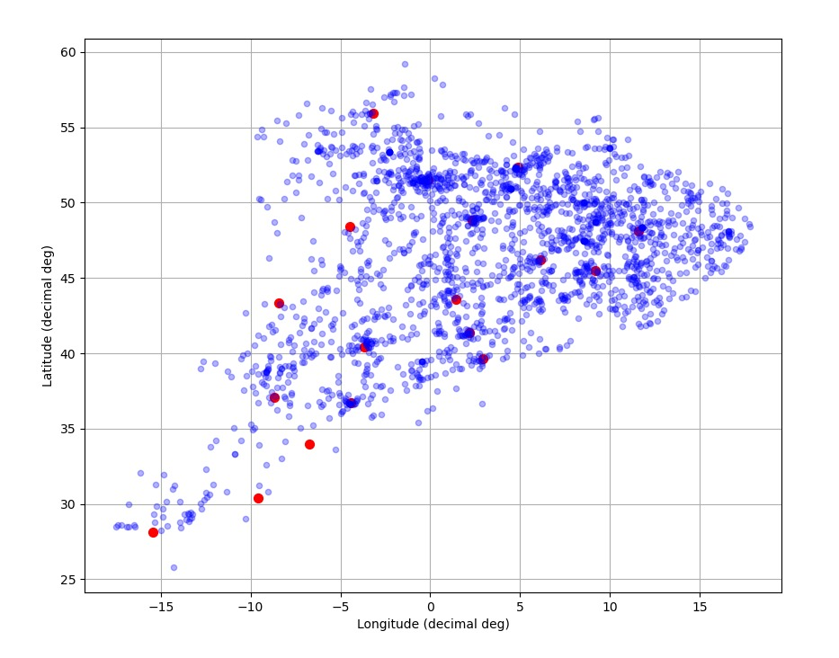
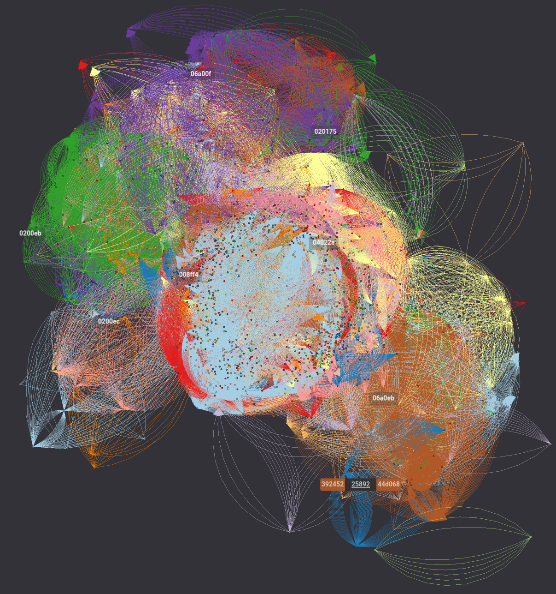
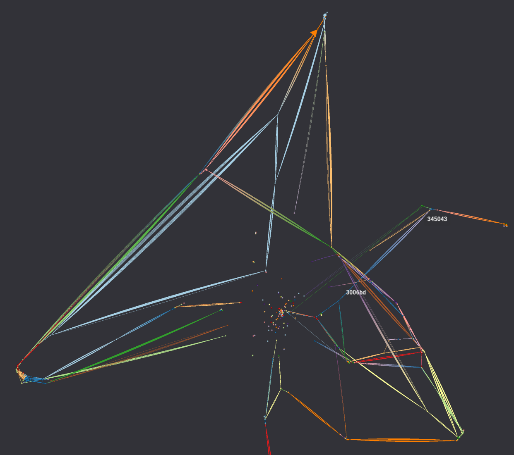
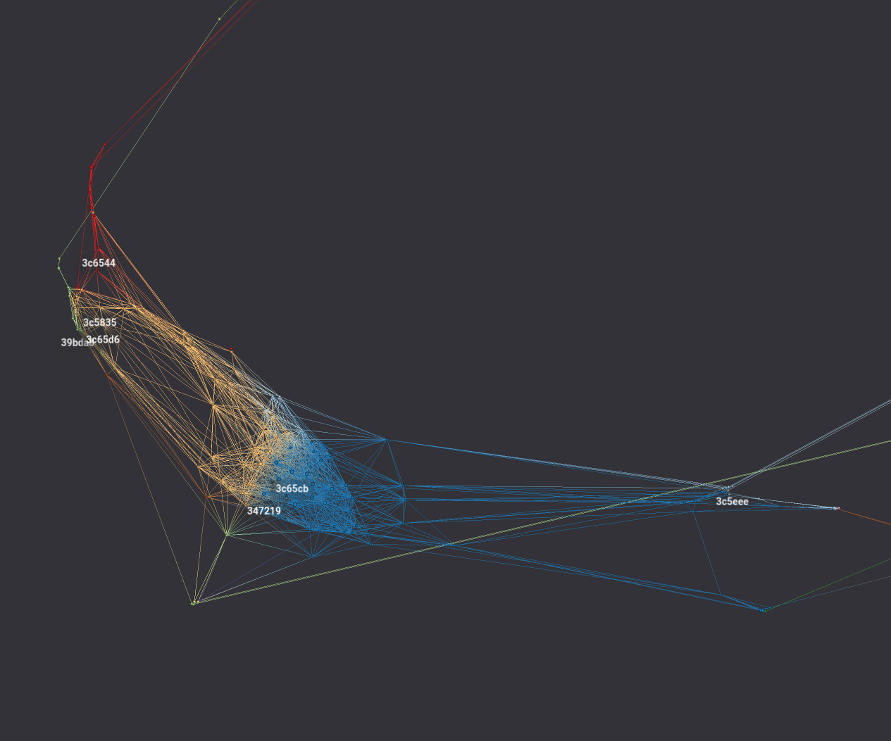

# Scope

This project spun off the developments in network and graph representation and analysis of an [epidemioloy process](https://github.com/gonzalo-villegas-curulla/EpidemiologyProblem.git).

In the epidemiology model, the SIR cells were represented by nodes of a graph and treated as a Gillespie process for two types of event propensities (infection and recovery). In the present case, the network is constituted by aircrafts and airports. See a simple representation below without graph edges of the Western Europe during day hours:

<!---->

  

# Methods

Data on aircraft location and other attributes is accessible by means of ADS-B signal and RTL-SDR devices (Realtek Software-Defined Radio). One of the most extended projects in the domain is [Airplanes.Live](https://airplanes.live/api-guide/), crowd-sourced, open source and with a documented API. Further reading on RTL-SDR, documentation, projects and posts may be found in the [RTL-SDR Blog](https://www.rtl-sdr.com/). It's a good start to get to know the minimum setup hardware, portability options, and how to choose and configure your setup.

# Potential objectives
* Determine robustness or weakness of the network 
* Analysis of cascaded events (e.g. delays, airspace buffer areas)
* Inspect the congestion (node degree, centrality, hubs) of main routes 
* Differentiate the behaviour of public airlines, cargo aircrafts and militar aircrafts

# Challenges
* A definition for nodes and interpretation of what roles do (1) moving aircrafts and (2) airports play in a network
* What type of graph best represents the elements and attributes of the system described?
* Accelerate code to process data, ideally, under quasi-real-time requests
* Interpretation and utilisation of sub-graphs
* Differentiate between stationary (zero baro-rate) and transient aircrafts maneuvering (i.e. landing or taking off)

# Tools
* `Networkx` for basic prototyping tasks in host code
* `CUDA`, `pyCUDA`, `cugraph` for acceleration, running device code and faster algebra in analysis (minimum compute capability of 7.0 is required to run on GPU device)
* `Graphistry` only resource for graph visualization
* `JSON` for data bases. Some relevant fields to store from each aricraft are:
    * `hex` ID of the aircraft
    * `ground_speed` and `true_speed`
    * `latitude`, `longitude`, and `altitude`
    * rate changes such as `baro_rate`
    * `now`: The time of the acquisition w.r.t. 1 January 1970 at 00:00:00 GMT

# Example showcase

Just under one minute of acquisition in the West of Europe (see Airplaines.live for API limitations), the data is encoded into ca. 2000 nodes. As for adjacency, there are many scenarios to consider for inter-aircraft separation (maneuver type, ground speed and Mach number, ground position instruments available, etc.), therefore we use for now a threshold of 37 km between nodes and a 1.1 overhead factor. See [ICAO's Chapter 3 of Annex 11](https://www.iacm.gov.mz/app/uploads/2018/12/an_11_Air-Traffic-Services_15ed._2018_rev.51_01.07.18.pdf) and [Chapter 5 of PANS-ATM(Doc 4444)](https://applications.icao.int/tools/ATMiKIT/story_content/external_files/story_content/external_files/DOC%204444_PANS%20ATM_en.pdf), which establish the minimal longitudinal, vertical and lateral separation between aircrafts. The most salient hubs are found by visual inspection in the vicinity of London and Paris, followed by Amsterdam. One possible visualization (using log scale Graphistry v2.41.8) is shown below with a zoom-in to London and Paris sub-graphs:

  <!---->
  <!---->
  
  

